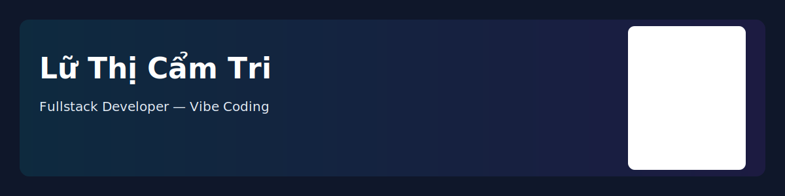

## Hi there 👋

<!--
**luthicamtri10/luthicamtri10** is a ✨ _special_ ✨ repository because its `README.md` (this file) appears on your GitHub profile.

Here are some ideas to get you started:

- 🔭 I’m currently working on ...
- 🌱 I’m currently learning ...
- 👯 I’m looking to collaborate on ...
- 🤔 I’m looking for help with ...
- 💬 Ask me about ...
- 📫 How to reach me: ...
- 😄 Pronouns: ...
- ⚡ Fun fact: ...
-->
#preamble

	

# Lữ Thị Cẩm Tri — Fullstack Developer (Vibe Coding)

Xin chào! Tôi là Lữ Thị Cẩm Tri 🌊

Tôi là sinh viên năm tư ngành Kỹ thuật Phần mềm tại Trường Đại học Sài Gòn (SGU). Tôi là một lập trình viên nhiệt huyết, chú ý tới chi tiết, chuyên phát triển các ứng dụng web và mobile có khả năng mở rộng. Triết lý làm việc của tôi là "Vibe Coding" — ưu tiên sáng tạo, tốc độ và hiệu quả bằng quy trình hỗ trợ bởi AI.

- 📍 Thành phố Hồ Chí Minh, Việt Nam
- 🎓 Dự kiến tốt nghiệp: Spring 2026
- 🚀 Mục tiêu: Tìm internship Fullstack Developer để đóng góp vào các sản phẩm có tác động thực tế

---

**Kỹ năng chuyên môn (Technical Skills & Expertise)**

🛠 Technical Stack

- **Backend:** C# / .NET Core 9.0 (Clean Architecture, MediatR, CQRS), Java Spring Boot (RESTful APIs)
- **Frontend:** React.js, Next.js, Tailwind CSS
- **Mobile:** React Native (Cross-platform) — đã triển khai tính năng như Location Tracking và QR Scanning
- **Database & Tools:** SQL Server, MySQL, Entity Framework Core, Git/GitHub, Docker, Postman
- **Ngôn ngữ:** TOEIC 670

---

**Kinh nghiệm dự án tiêu biểu (Featured Projects)**

1) Automated Narration & Stall Management System — Vinh Khanh Market Ecosystem

	 - Vai trò: Frontend & Mobile Developer
	 - Tổng quan: Nền tảng web và mobile tập trung, số hóa vận hành chợ và nâng cao trải nghiệm du khách.
	 - Tính năng chính:
		 - Phát thuyết minh tự động theo vị trí (Location Tracking) hoặc quét QR Code
		 - Role-Based Access Control (Admins, Merchants, Users)
		 - Booking và thanh toán tích hợp
	 - Tech Stack: React Native (Mobile), React.js (Web), Java Spring Boot, MySQL
	 - Source: https://github.com/thankhanh/Seminar_sgu

2) StoreApp — Store Management System (E-commerce Backend)

	 - Vai trò: Backend Developer
	 - Kiến trúc: Xây dựng với ASP.NET Core 9.0 theo Clean Architecture (Onion) để đảm bảo khả năng bảo trì và mở rộng.
	 - Tính năng chính:
		 - Bảo mật: JWT Authentication với Refresh Tokens và xác thực OTP qua email
		 - Xử lý đơn hàng: Tích hợp cổng VNPay và dịch vụ nền (Order AutoCancelService) để hủy đơn chưa thanh toán khi hết hạn
		 - Quản lý tồn kho: Quản lý nhập kho thông qua Good Received Notes (GRN)
		 - Thiết kế: Sử dụng MediatR (CQRS), Repository Pattern và Fluent Validation
	 - Source: https://github.com/thaovy3724/ASP.NET

---

**Thông tin liên hệ (Contact)**

📫 Let's Connect!

- **Email:** lutri29102004@gmail.com
- **LinkedIn:** https://linkedin.com/in/tri-lữ-thị-cẩm
- **GitHub:** https://github.com/luthicamtri10
- **Phone:** 0367211799

---

Nếu bạn quan tâm hợp tác, internship hoặc muốn xem chi tiết dự án, cứ liên hệ trực tiếp qua email hoặc GitHub — tôi rất sẵn lòng trao đổi thêm!
